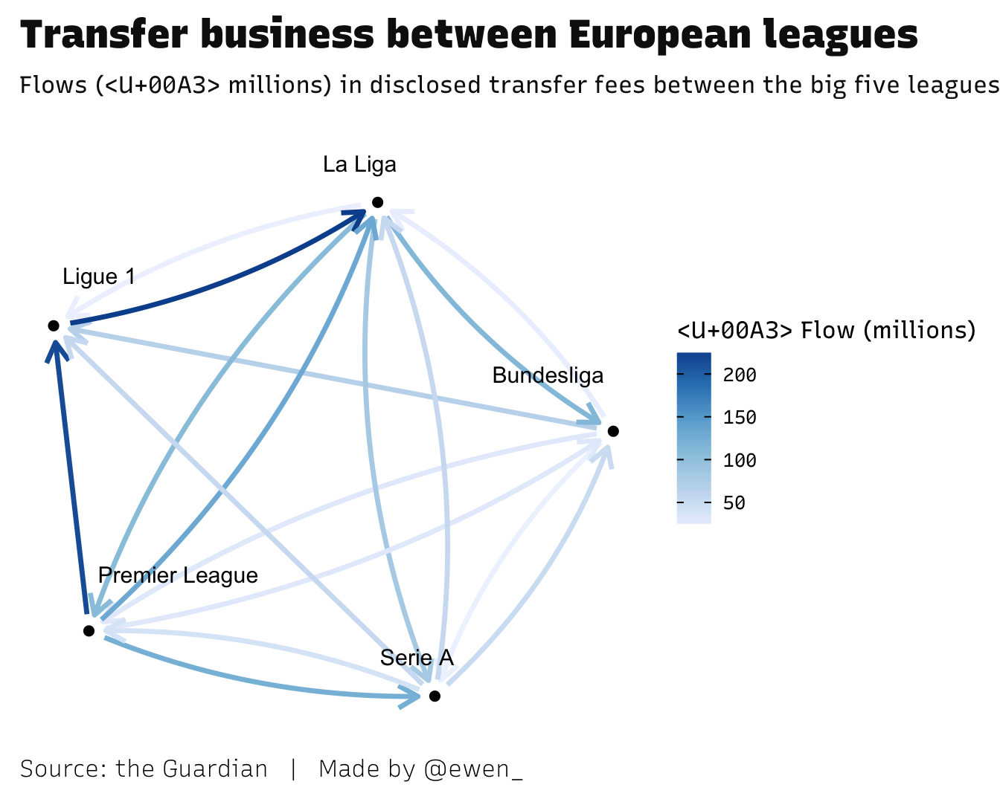

Followers of European football will be familiar with the infamous transfer
window system, which endears clubs to buy and sell players in a specified
period - once in the off-season (summer), and once at the turn of each calendar
year. This constraint has invited increasingly peculiar and precarious market
activity over the years, as clubs vie to secure the hottest new talents with
varying parts method and madness. Meanwhile, fans lap up newspaper gossip
columns and tell friends "he looks quality on YouTube" as they frantically
research the latest "wunderkind" their club has been linked with. It's a truly
beguiling collection of rituals and rhetoric (that I helplessly pander to each
year).

The off-season transfer window closed shut recently, on August 31st across
Germany, England, France and Italy. Spain got given slightly longer to finish
their business, until the 1st September (a bizarre quirk that is befitting of
such a madcap period). As a follower of (English) Premier League football,
primarily, the way in which media outlets stoke up the tension here as the
window draws to a close really has to be seen to be believed. Chief culprits
include Sky Sports, who's latest excruciating move in drama marginal gains
includes presenters coordinating the colour of their clothes with the canary
yellow news ticker on their rolling TV coverage of the window's 'deadline day'
(caption competition, indeed).

Behind this cacophony of noise, what actually went down in the window?
Hopefully, a proper look at the data can help reveal some truths and help me
scratch this particular itch.[^1]

## Some tweets I made earlier

In early skirmishes with transfer window data, I had managed to scrape
[Transfermarkt's](https://www.transfermarkt.co.uk/) site for player transfer
data and produced some neat dumbbell-style plots that people seemed to get on
with.

These nicely illustrated intra-league transfer window behaviour, highlighting
big buyers and sellers (as well as club's balances) relative to the league
itself. One feature that may go unnoticed is the ranking of the y-axis - the
clubs have been ordered by their final league position in the previous season
(with the promoted clubs at the bottom). This decision means that clubs are
proximal to others who demonstrated similar league performance (a reasonable
proxy for team quality), and spend information can be compared non-arbitrarily
in this way.

However, there wasn't any kind of time-stamp present in Transfermarkt's
collation of transfer data, which was a dimension I wanted to explore. I would
have to try my luck elsewhere.

Luckily for me, the Guardian ran a
[transfer window interactive](https://www.theguardian.com/football/ng-interactive/2017/jun/22/transfer-window-2017-every-deal-in-europes-top-five-leagues)
that included information about _when_ transfers happened. A quick
`jsonlite`/`lubridate`/`dplyr`/`forcats` combo is all I needed to grab, parse
and clean the data for my purposes (remember to head for the footnotes if you
want the code relief).

With that, the temporal aspect of the transfer window is ours.

## Watching the window go by

As mentioned earlier, there is a perceived high-stakes end to the window here in
England, possibly fuelled by sensationalist third-parties in the media (among
other factors). Given that the other major European leagues find their
opportunities for business cut off at the same time, is there a widespread spike
in business as the deadline approaches?

We see the biggest peak in player buys, across all leagues, comes around the
start of July (coinciding with the 1st July opening of the window). Business is
done earlier than this date, as players agree moves prior to officially jumping
ship. It appears that the quickest clubs to start moving are in Germany
(Bundesliga), while the biggest spike near to the deadline is clearly in England
(Premier League) as their clubs continue to do business later, relative to the
others. It is hard to tell haw much media furore influences this late activity
(a self-fulfilling prophecy, perhaps), and there are other factors to consider -
even an executive's hard negotiating style can make a club's business likely to
drag on.

Another component is that of the loan market, which is a different beast -
essentially, club's (usually those less esteemed) borrowing players from another
club, usually for a season. It may be that a league's behaviour in this market
differs from full transfers.

Ah - now we see what the other leagues were up to, closer to the deadline. It's
noticeable that permanent transfers are mostly done earlier, peaking in July as
already mentioned, while loan business is more often than not left until the
last knockings.

## Following the money

We have an idea of the deadline day effect in transfer activity terms, but
haven't yet delved into the finances. I'm dying to know just how much business
is left until those final hours.[^2]

Huh. While over 13% of all transfer spend by the Premier League is done on the
final day, it turns out that _nothing_ was spent on La Liga's extra day
(remember, this is disclosed fees only, and doesn't include player loan deals).
A failed experiment, perhaps, with the rest of the big leagues shutting up shop
by then? Too soon to tell, but I'll be patiently waiting to see if the same
thing happens next year...

There are usually some headline-grabbing moves made each summer, and this one
got a bit silly. Neymar moved to Paris Saint Germain for £197 million, with
fears about inequality in spending power reaching fever pitch.

That deal I mentioned helped PSG on their way to sinking over 40% of the entire
leagues business, in financial terms. If anyone from the Financial Fair Play
(FFP - a real thing, promise) committee is reading - get at me.

This doesn't tell the full story - Neymar actually moved from Barca to PSG, so a
lot of their spending was triggered by that whole palava, and clubs did business
the other way of course. You can refer to my tweets at the start if you're
interested in how different clubs fared with their "in's and out's".

Speaking of in's and out's, working with flow data lends itself nicely to some
network visualisation. I've banged on about who's spending money, but what does
this web of business look like?

Notice how little other leagues choose to plunder the Premier League...I'll
leave that can of worms for another day.

[^1]:
    To keep the post concise I don't show all of the code, especially code that
    generates figures. But you can find the full code
    [here](https://github.com/ewenme/site/blob/main/content/posts/2017-09-07-dissecting-euro-football-transfers/index.Rmd).

[^2]:
    Transfer spend in this article refers to _disclosed fees only_. The Guardian
    did make estimates of fees, where appropriate.
