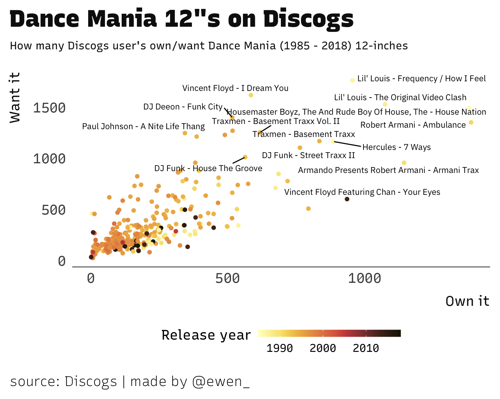

I've been working on a new R package.
[**`discogger`**](https://github.com/ewenme/discogger) is an open-source effort,
at an experimental stage of development, providing straightforward tools to help
out with Discogs' [API v2.0](https://www.discogs.com/developers/#).
[Discogs](https://www.discogs.com) is a crowd-sourced music database and
marketplace, a proper treasure trove for record diggers and music lovers to
learn more about what they're jamming to. A better route into this data for R
users should yield some nice results.

## discogger 101

First up, you'll need to register a Discogs application via
<https://www.discogs.com/settings/developers>. Doing so will grant you a
"personal access token" (accessible at the same link above) which you can store
as an environment variable (_DISCOGS_API_TOKEN_) using the
[`discogs_api_token()`](https://ewenme.github.io/discogger/reference/discogs_api_token.html)
function. All functions in the `discogger` package will automatically look for
your token and prompt entry if it isn't found.

The `discogger` interface to Discogs data currently spans
[Database](https://www.discogs.com/developers/#page:database) (releases,
artists, labels) and
[User Collection](https://www.discogs.com/developers/#page:user-collection) API
requests, with a view to growing functionality in these spaces and eventually
expanding into
[Marketplace](https://www.discogs.com/developers/#page:marketplace) (inventory,
orders). The next section will demo how these functions can be put in to use,
and chained together for quietly impressive analyses.

## Diggin' in to Dance Mania

[Dance Mania](http://dancemaniarecords.com/) is about as iconic as it gets when
it comes to Chicago House record labels (you hopefully got a flavour by clicking
on the name...). `discogger` is well equipped to retrieve record label
information, with
[`discogs_label()`](https://ewenme.github.io/discogger/reference/discogs_label.html)
first up.

<pre class='chroma'><code class='language-r' data-lang='r'># load packages
<a href='https://rdrr.io/r/base/library.html'>library</a>(<a href='https://ewenme.github.io/discogger'>discogger</a>)
<a href='https://rdrr.io/r/base/library.html'>library</a>(<a href='https://tidyverse.tidyverse.org'>tidyverse</a>)

# get DM label info
<a href='https://ewenme.github.io/discogger/reference/discogs_label.html'>discogs_label</a>(label_id = 314)
#&gt; &lt;Discogs labels/314&gt;
#&gt; Preview: 1 of 12 results. 
#&gt; List of 1
#&gt;  $ id: int 314</code></pre>

Hopefully you learnt something new from that output, but it's not particularly
ready for any analysis. I'm quite interested in getting more detailed metadata
around Dance Mania's 12\" releases, which can be done with
[`discogs_label_releases()`](https://ewenme.github.io/discogger/reference/discogs_label_releases.html).

<pre class='chroma'><code class='language-r' data-lang='r'># get DM releases
dm_releases &lt;- <a href='https://ewenme.github.io/discogger/reference/discogs_label_releases.html'>discogs_label_releases</a>(label_id = 314)
  
# extract request content
dm_releases_df &lt;- dm_releases$content <a href='https://magrittr.tidyverse.org/reference/pipe.html'>%&gt;%</a>
  # return 12" releases only
  dplyr::<a href='https://dplyr.tidyverse.org/reference/filter.html'>filter</a>(<a href='https://rdrr.io/r/base/grep.html'>grepl</a>('12"', format)) <a href='https://magrittr.tidyverse.org/reference/pipe.html'>%&gt;%</a> 
  <a href='https://tibble.tidyverse.org/reference/as_tibble.html'>as_tibble</a>()

dm_releases_df
#&gt; # A tibble: 599 × 14
#&gt;    status   format     catno  thumb    resource_url  title     id  year artist  
#&gt;    &lt;chr&gt;    &lt;chr&gt;      &lt;chr&gt;  &lt;chr&gt;    &lt;chr&gt;         &lt;chr&gt;  &lt;int&gt; &lt;int&gt; &lt;chr&gt;   
#&gt;  1 Accepted "12\""     14040  https:/… https://api.… Hous… 6.40e4  1987 The Hou…
#&gt;  2 Accepted "12\""     51002… https:/… https://api.… What… 1.09e6  1985 The Bro…
#&gt;  3 Accepted "12\""     B.C. … https:/… https://api.… Hous… 4.21e5  1987 The Hou…
#&gt;  4 Accepted "12\""     B.C. … https:/… https://api.… Hous… 1.97e5  1987 The Hou…
#&gt;  5 Accepted "12\""     BASIC… https:/… https://api.… Akce… 3.64e4  1998 DJ Deeon
#&gt;  6 Accepted "12\""     D.J. … https:/… https://api.… Frea… 6.75e4  1996 D.J. Fu…
#&gt;  7 Accepted "12\", TP" D.M. … https:/… https://api.… This… 5.17e6  1988 Mello D.
#&gt;  8 Accepted "12\""     D.M. … https:/… https://api.… This… 4.27e5  1988 Mello D.
#&gt;  9 Accepted "12\""     DM 003 https:/… https://api.… Hous… 7.30e3  1986 The Hou…
#&gt; 10 Accepted "12\""     DM 004 https:/… https://api.… Hard… 1.4 e3  1987 Duane &amp;…
#&gt; # … with 589 more rows, and 5 more variables:
#&gt; #   stats.community.in_wantlist &lt;int&gt;, stats.community.in_collection &lt;int&gt;,
#&gt; #   stats.user.in_wantlist &lt;int&gt;, stats.user.in_collection &lt;int&gt;,
#&gt; #   label_id &lt;dbl&gt;</code></pre>

The tidy tibble format returned is much better suited to analysis in R, but the
content I'm after is not quite there. Turns out community metrics, such as the
number of users who own or have marked a record as one they "want", are
available from a records release page (not it's label release listing).
[`discogs_release()`](https://ewenme.github.io/discogger/reference/discogs_release.html)
can be used, in conjunction with
[`map()`](https://purrr.tidyverse.org/reference/map.html) (from the
[`purrr`](https://purrr.tidyverse.org/) package), to iterate through releases
and collect this information.

<pre class='chroma'><code class='language-r' data-lang='r'># get DM release info
dm_releases_info &lt;- <a href='https://purrr.tidyverse.org/reference/map.html'>map</a>(dm_releases_df$id, discogs_release)

# extract release content
dm_releases_content &lt;- <a href='https://purrr.tidyverse.org/reference/map.html'>map</a>(dm_releases_info, "content")
  
# extract fields relevant for community metrics analysis
dm_community_metrics &lt;- <a href='https://tibble.tidyverse.org/reference/tibble.html'>tibble</a>(
  title = <a href='https://purrr.tidyverse.org/reference/map.html'>map_chr</a>(dm_releases_content, "title"),
  artist = <a href='https://purrr.tidyverse.org/reference/map.html'>map_chr</a>(dm_releases_content, "artists_sort"),
  year = <a href='https://purrr.tidyverse.org/reference/map.html'>map_int</a>(dm_releases_content, "year"),
  have = <a href='https://purrr.tidyverse.org/reference/map.html'>map_int</a>(dm_releases_content, <a href='https://rdrr.io/r/base/c.html'>c</a>("community", "have")),
  want = <a href='https://purrr.tidyverse.org/reference/map.html'>map_int</a>(dm_releases_content, <a href='https://rdrr.io/r/base/c.html'>c</a>("community", "want"))
  ) <a href='https://magrittr.tidyverse.org/reference/pipe.html'>%&gt;%</a>
  # for each record...
  <a href='https://dplyr.tidyverse.org/reference/group_by.html'>group_by</a>(title, artist) <a href='https://magrittr.tidyverse.org/reference/pipe.html'>%&gt;%</a>
  <a href='https://dplyr.tidyverse.org/reference/filter.html'>filter</a>(
    # keep the one most users have...
    have == <a href='https://rdrr.io/r/base/Extremes.html'>max</a>(have),
    # ...and rm releases with missing release year
    year &gt;= 1985
    ) <a href='https://magrittr.tidyverse.org/reference/pipe.html'>%&gt;%</a> 
  <a href='https://dplyr.tidyverse.org/reference/group_by.html'>ungroup</a>()

dm_community_metrics
#&gt; # A tibble: 313 × 5
#&gt;    title                      artist                            year  have  want
#&gt;    &lt;chr&gt;                      &lt;chr&gt;                            &lt;int&gt; &lt;int&gt; &lt;int&gt;
#&gt;  1 What's That                Browns, The                       1985    86   276
#&gt;  2 Akceier 8                  DJ Deeon                          1998   214    82
#&gt;  3 Freaky Style Take: 2       DJ Funk                           1996   221   257
#&gt;  4 This X-Mas Rap             Mello D.                          1988     3    36
#&gt;  5 This Christmas (Rap)       Mello D.                          1988    41    98
#&gt;  6 House Nation               Housemaster Boyz, The And Rude …  1986  1381  1494
#&gt;  7 Hard Core (On The One)     Duane &amp; Co.                       1987   538   344
#&gt;  8 Jack My Body               Yellow House                      1987   402   359
#&gt;  9 Frequency (Out Of Control) Lil' Louis                        1987     4   460
#&gt; 10 Insane                     Suburban Boyz                     1988   340   608
#&gt; # … with 303 more rows</code></pre>

With this output, a visualisation can be knocked up to explore which Dance Mania
12-inches Discogs users want or own.

<pre class='chroma'><code class='language-r' data-lang='r'># load viz helpers
<a href='https://rdrr.io/r/base/library.html'>library</a>(<a href='https://github.com/thomasp85/scico'>scico</a>)
<a href='https://rdrr.io/r/base/library.html'>library</a>(<a href='http://github.com/ewenme/ewenthemes'>ewenthemes</a>)
<a href='https://rdrr.io/r/base/library.html'>library</a>(<a href='https://github.com/slowkow/ggrepel'>ggrepel</a>)

# plot
<a href='https://ggplot2.tidyverse.org/reference/ggplot.html'>ggplot</a>(dm_community_metrics, <a href='https://ggplot2.tidyverse.org/reference/aes.html'>aes</a>(x=have, y=want)) +
  <a href='https://ggplot2.tidyverse.org/reference/geom_point.html'>geom_point</a>(<a href='https://ggplot2.tidyverse.org/reference/aes.html'>aes</a>(colour=year)) +
  <a href='https://rdrr.io/pkg/ggrepel/man/geom_text_repel.html'>geom_text_repel</a>(<a href='https://ggplot2.tidyverse.org/reference/aes.html'>aes</a>(label=<a href='https://rdrr.io/r/base/paste.html'>paste0</a>(artist, " - ", title)), size=3,
                  data = <a href='https://rdrr.io/r/base/subset.html'>subset</a>(dm_community_metrics, have &gt;= 800 | want &gt;= 1000),
                  family = "IBM Plex Sans") +
  <a href='https://ggplot2.tidyverse.org/reference/labs.html'>labs</a>(title="Dance Mania 12\"s on Discogs", 
       subtitle="How many Discogs user's own/want Dance Mania (1985 - 2018) 12-inches",
       x = "Own it", y = "Want it",
       caption="source: Discogs | made by @ewen_") +
  <a href='https://rdrr.io/pkg/ewenthemes/man/theme_ewen_rs.html'>theme_ewen_rs</a>(grid = FALSE, subtitle_size = 11, subtitle_margin = 20) +
  scico::<a href='https://rdrr.io/pkg/scico/man/ggplot2-scales.html'>scale_colour_scico</a>(palette = "lajolla") +
  <a href='https://ggplot2.tidyverse.org/reference/guides.html'>guides</a>(col = <a href='https://ggplot2.tidyverse.org/reference/guide_colourbar.html'>guide_colourbar</a>(direction = "horizontal", title = "Release year",
                               barheight = 0.5, barwidth = 10, title.vjust = 1)) +
  <a href='https://ggplot2.tidyverse.org/reference/theme.html'>theme</a>(legend.position = "bottom")
</code></pre>

## Close

For more on installation, development status and for (very welcome)
contributions or issues, check in at the
[Github repo](https://github.com/ewenme/discogger). I'll look to list features I
intend to introduce there - feel free to beat me to the punch on any of those.

> Music is a language, you see, a universal language. Sun Ra
