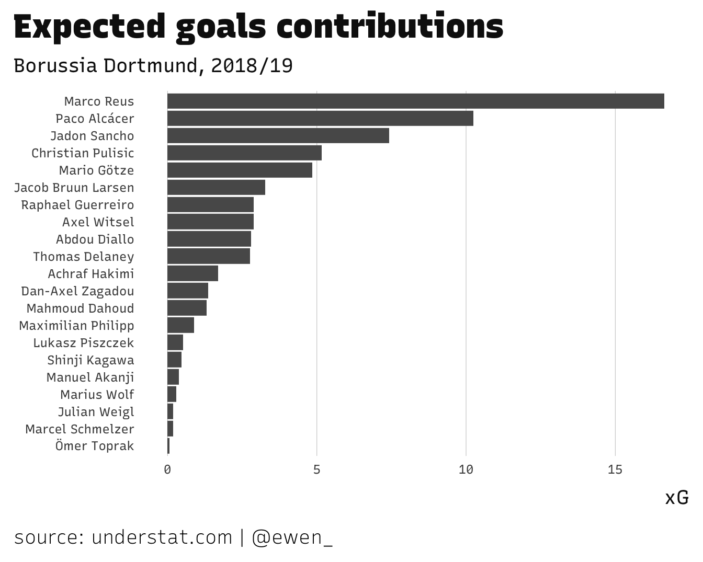

[understat](https://understat.com/) is a treasure trove of football statistics
and advanced metrics. All of your ~~"old man yells at cloud" conjuring~~
household favourites are here. Democratized access to xG for casuals everywhere,
so we can do unholy things like this.

<blockquote class="twitter-tweet" data-lang="en">

<a href="https://t.co/cNiXEsfAms">pic.twitter.com/cNiXEsfAms</a>

--- Ryan O\'Hanlon (@rwohan) <a href="https://twitter.com/rwohan/status/1071159056096579585?ref_src=twsrc%5Etfw">December 7, 2018</a>
</blockquote>

While the site itself is easy to navigate and features nice off-the-shelf
exploratory viz tools (à la the above radar), many (myself included) can get a
bit fidgety without access to all this stuff in a structured format for
analysis.

So, I made a thing to grab understat data and tidy it up, so you can get on with
the interesting stuff. Say 👋 to
[understatr](https://github.com/ewenme/understatr), an
[R](https://www.r-project.org/) package that makes pulling xG numbers as easy as
🥧

<pre class='chroma'><code class='language-r' data-lang='r'># load package
<a href='https://rdrr.io/r/base/library.html'>library</a>(<a href='https://ewenme.github.io/understatr'>understatr</a>)

# get dortmund playing squad data for this season
dortmund &lt;- <a href='https://ewenme.github.io/understatr/reference/get_team_players_stats.html'>get_team_players_stats</a>(team_name = "Borussia Dortmund", year = 2018)

dortmund
#&gt; # A tibble: 23 × 19
#&gt;    player_id player_name  games  time goals    xG assists    xA shots key_passes
#&gt;        &lt;dbl&gt; &lt;chr&gt;        &lt;dbl&gt; &lt;dbl&gt; &lt;dbl&gt; &lt;dbl&gt;   &lt;dbl&gt; &lt;dbl&gt; &lt;dbl&gt;      &lt;dbl&gt;
#&gt;  1      2380 Paco Alcácer    26  1181    18 10.2        0  1.61    52         15
#&gt;  2       319 Marco Reus      27  2335    17 16.6        8  6.94    69         38
#&gt;  3      6345 Jadon Sancho    34  2463    12  7.42      14  8.31    40         63
#&gt;  4       422 Mario Götze     26  1694     7  4.84       7  6.64    28         41
#&gt;  5      2662 Christian P…    20   916     4  5.16       4  2.97    27         21
#&gt;  6      3059 Axel Witsel     33  2873     4  2.88       1  2.03    36         16
#&gt;  7      5230 Thomas Dela…    30  2302     3  2.76       5  2.90    33         15
#&gt;  8      3455 Raphael Gue…    23  1539     2  2.88       6  3.94    35         38
#&gt;  9      5197 Achraf Haki…    21  1740     2  1.69       4  2.96    20         11
#&gt; 10      5355 Jacob Bruun…    24  1267     2  3.27       2  3.16    26         17
#&gt; # … with 13 more rows, and 9 more variables: yellow_cards &lt;dbl&gt;,
#&gt; #   red_cards &lt;dbl&gt;, position &lt;chr&gt;, team_name &lt;chr&gt;, npg &lt;dbl&gt;, npxG &lt;dbl&gt;,
#&gt; #   xGChain &lt;dbl&gt;, xGBuildup &lt;dbl&gt;, year &lt;dbl&gt;</code></pre>

You can use this in conjunction with the [tidyverse](https://www.tidyverse.org/)
to get from data to viz lighting-quick.

<pre class='chroma'><code class='language-r' data-lang='r'><a href='https://rdrr.io/r/base/library.html'>library</a>(<a href='https://tidyverse.tidyverse.org'>tidyverse</a>)
<a href='https://rdrr.io/r/base/library.html'>library</a>(<a href='http://github.com/ewenme/ewenthemes'>ewenthemes</a>) # (a personal chart themes pkg)

dortmund <a href='https://magrittr.tidyverse.org/reference/pipe.html'>%&gt;%</a> 
  # remove players w/ zero xG
  <a href='https://dplyr.tidyverse.org/reference/filter.html'>filter</a>(xG &gt; 0) <a href='https://magrittr.tidyverse.org/reference/pipe.html'>%&gt;%</a> 
  # chart xG in desc order
  <a href='https://ggplot2.tidyverse.org/reference/ggplot.html'>ggplot</a>(<a href='https://ggplot2.tidyverse.org/reference/aes.html'>aes</a>(x = <a href='https://rdrr.io/r/stats/reorder.factor.html'>reorder</a>(player_name, xG), y = xG)) +
  # make it a bar chart
  <a href='https://ggplot2.tidyverse.org/reference/geom_bar.html'>geom_col</a>() +
  # flip the bars
  <a href='https://ggplot2.tidyverse.org/reference/coord_flip.html'>coord_flip</a>() +
  # add some labels (making sure to credit understat!)
  <a href='https://ggplot2.tidyverse.org/reference/labs.html'>labs</a>(title = "Expected goals contributions", subtitle = "Borussia Dortmund, 2018/19",
       x = NULL, caption = "source: understat.com | @ewen_") +
  # add my personal chart theme
  <a href='https://rdrr.io/pkg/ewenthemes/man/theme_ewen_rs.html'>theme_ewen_rs</a>(grid = "X", axis = FALSE, axis_text_size = 9)
</code></pre>

Peep the project's GitHub page for updates, for now at least. As noted in the
[readme](https://github.com/ewenme/understatr/blob/master/README.md), while
non-commercial use of the data is fine for now, I don't own it and similarly
don't control changes to the website. I say this to say that `understatr` may
break (or become illegal) in future, so enjoy it while you can 🎈 I'd be psyched
to hear about people using it, or even contributing to it. Esp. here for the
hottest of hot take Messi radar trolls, please cite the proj in all of those.
