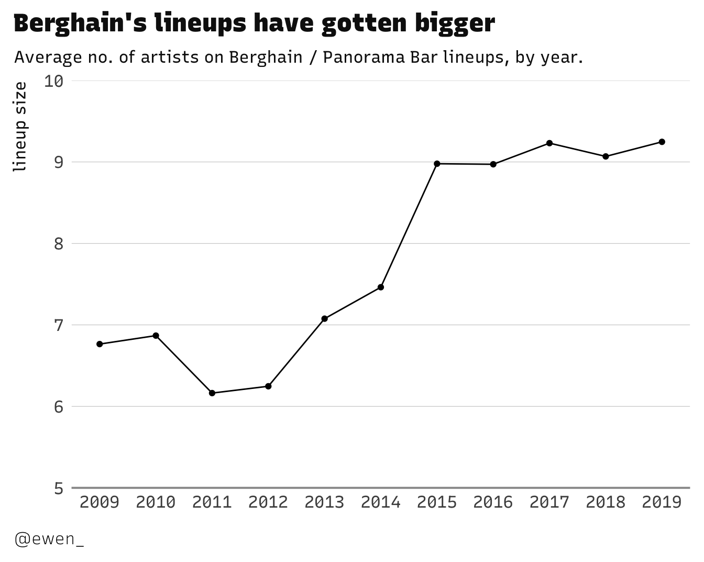

[Berghain](http://berghain.de/) is (in)famous for many things. The strict no
photography and door policies (which you can take on, VR-style, via
[berghaintrainer](https://berghaintrainer.com/)), for starters. It also puts on
cool parties, sometimes...

What's also cool is, Berghain's site still hosts their programming history on
the site. This goes all the way
[back to 2009](http://berghain.de/events/2009-12) (check Hudson Mohawke
vs. Rustie on the WARP 20 night - I miss Rustie 😢). Some really neat projects
have taken advantage of this public archive, like Artiom Dashinsky's
[Numbers of Berghain](http://dashinsky.com/berghain-statistics/) piece (which,
in turn, makes use of
[Olle Holmberg's googlesheet collating 2009-2017 events](https://docs.google.com/spreadsheets/d/1r_OJHzKBwDFIK0YoLSX65g-jp_5djxx-9d4x1-LKUsw/edit#gid=1355724553)).

I managed to pull listings from December 2009 through to July 2019 (at time of
writing), now hosted in
[this aptly-named GitHub repo](https://github.com/ewenme/berghain). Here's the
kind of stories you can quickly get into with it.

Shout me if you do anything cool w the data ✊
