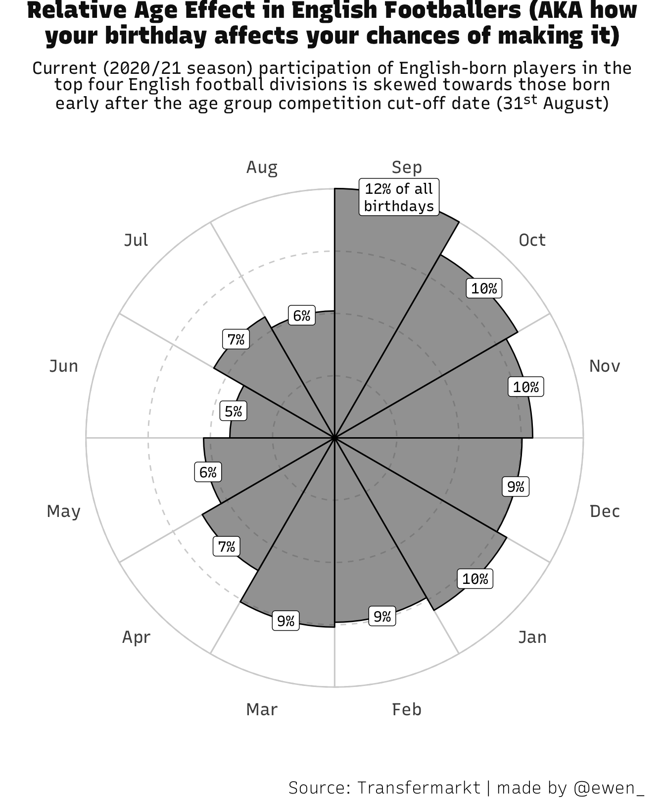

Relative Age Effect (RAE) describes a phenomenon where a child who is born in
the early part of a selection period gains a material advantage over a child
born late in the selection period. The most common examples occur in academia
and sport, where cohorts of children tend to be selected by establishing a
somewhat arbitrary "cut-off" date (e.g. the UK school year starts in early
September). Those born nearer to the cut-off date may demonstrate greater
abilities than younger peers, simply because of this additional growth and
development time. However, in practice this quirk can quickly entrench itself
through all manner of biases -- like greater attention from teachers, in
academic settings -- that only gets compounded over time as the performance gap
is reinforced.

While we're on the subject, there are many more systemic biases at play in such
academic (and other) settings which often affect marginalised groups most
severely and reinforce historic inequalities. For example,
[black students' predicted A-level grades are the least accurate](https://www.timeshighereducation.com/blog/does-ethnicity-influence-likelihood-admission-university#survey-answer).
RAE plays a part in influencing outcomes, but isn't the only answer.

Relative age effect in sport was (probably) popularised by Malcom Gladwell's
_Outliers_, despite lots of pre-existing interest in the field itself. In the
book, Gladwell stumbles across the case of elite Canadian hockey players, in
which 40% of players were found to have been born in January, February, or March
(with the cut-off for age competition in hockey at the start of the calendar
year). I was curious about the incidence of this effect in English football a
couple of years ago, and discovered something pretty similar.

[This post got quite a lot of attention](https://www.reddit.com/r/dataisbeautiful/comments/83ejdw/relative_age_effect_in_english_footballers_your/),
which I think speaks to the fact that its quite a relatable story -- everyone
has a birthday, and many dreamed of making it as a pro. However, the
visualisation itself hasn't aged well (which I'll leave for a future post). So,
I thought I'd give this one a "remaster" of sorts:

Shouting out Tom Worville, as ever, for
[makeover inspiration](https://twitter.com/Worville/status/1320409463971549184)
🍕
