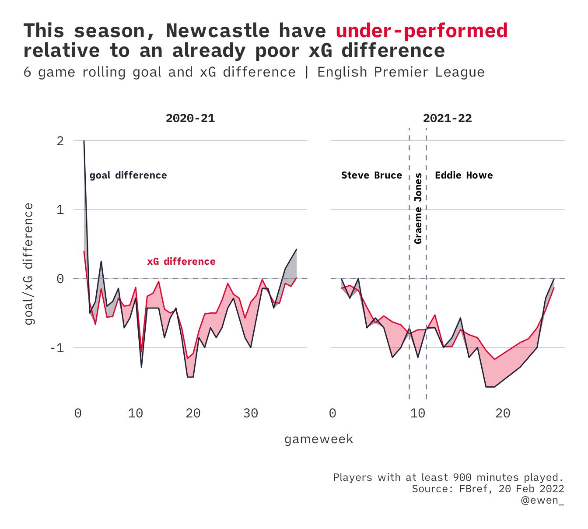
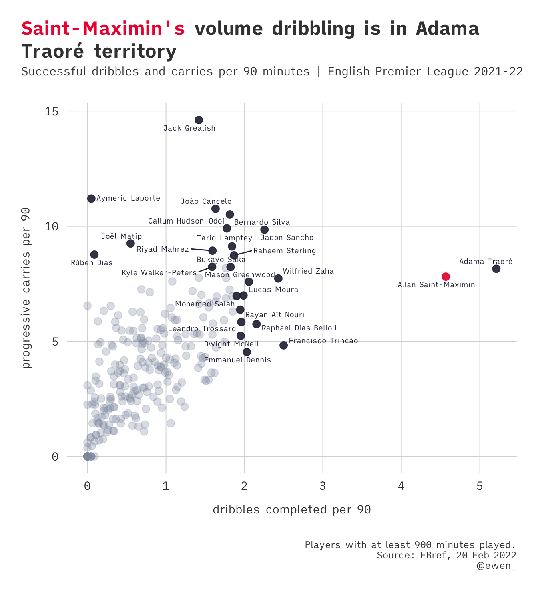
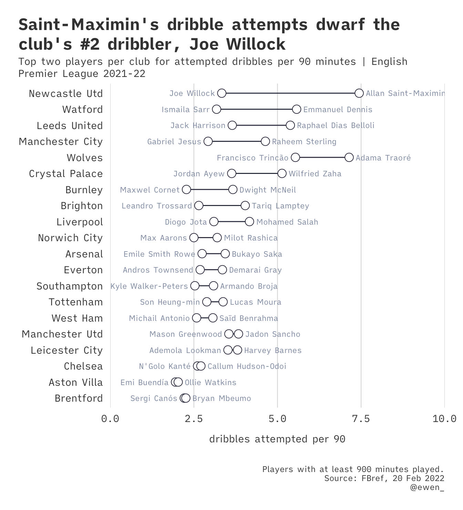
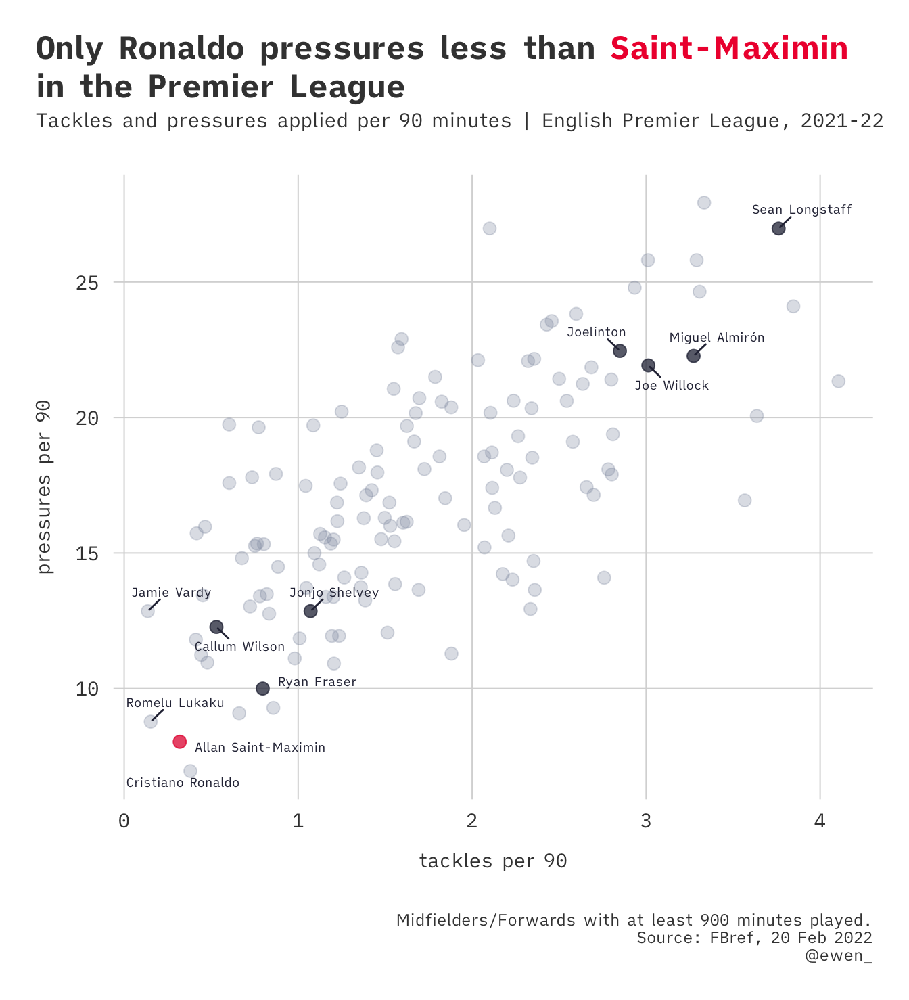

For my sins, I am a Newcastle United fan. Watching them play has been hard graft
for a decent while. Going deep in the UEFA Cup seems like a very quaint memory.
There's reason for renewed sporting optimism, with a helping of geopolitical
pessimism, now
[the club is owned by Saudi Arabia](https://www.bbc.co.uk/sport/football/58826899)
(for what it's worth, the previous owner Mike Ashley, has been
[regularly accused of paying staff below minimum wage](https://www.theguardian.com/business/2020/jul/23/sports-direct-undercover-minimum-wage-mike-ashley),
so the bar is unthinkably low).

These sport~~wash~~ing revolutions typically involve waves of new players
turning up to appease the new regime and expectations, inevitably taking places
off of (mostly) technically limited members of the squad first. Longer term,
this gentrification tends to be all-encompassing. I wanted to pay tribute to the
player that has managed to light up countless diabolical performances across
some forgettable seasons, while there's time left to enjoy more.

First, a chart to convey the relative pain that comes with watching the current
Newcastle team.

Not only has the xG difference been mostly below zero for two consecutive
seasons (i.e. no. of goals Newcastle should have scored, given the quality of
chances created, minus the no. of goals their opposition should have scored),
their actual goal difference has mostly lagged behind this as well. This is
characteristic of a low-quality team.

So, why bother? Even in the darkest days of Sports Direct FC, there have been
glimmers of joy to grab with both hands. Once upon a time, Alan Pardew might
have treated us with a Hatem Ben Arfa cameo. Today, we are pacified by the
one-man dribbling band that is Allan Saint-Maximin.

Given that Adama has now left the league, if you want to watch a jinking winger
there is literally no competition. This is compounded by the fact that he plays
for Newcastle, where the next most dribble-happy teammate is a way off. The
"second guy" is further away than any other PL team.

How does he do it? Well, it turns out that Allan doesn't really do much of
anything out of possession. There's only one fella that pressures the opposition
less (guess who).

tired: ASM is preserved for when Newcastle are in possession and need him to get
the team up the field.

inspired: ASM doesn't need to defend because he is doing up defences like this.
Never change.

{}

