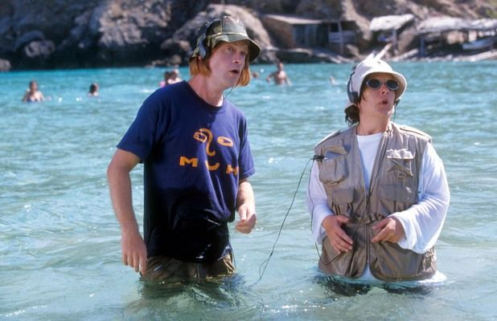

I came across a jokes slice of radio today. Words of Intent (FKA R.O.S.H),
Chande and Guppy Slim's
["The Nasal Hour"](https://soundcloud.com/balamii/the-nasal-hour-w-works-of-intent-chande-guppy-slim-january-2022),
broadcasted January 2022, toasts "the top 10 hottest dance tracks of 2011".
Think
[Forward Motion](https://www.youtube.com/watch?v=1yD2uhjQqsI&ab_channel=RECORDOirelles)
rubbing shoulders with
[Battle For Middle You](https://www.youtube.com/watch?v=aLqWjUWGYFA&ab_channel=TedHartkamp).
Spoof pirate radio adverts lovingly made by pals are weaved in and the mic chat
comes like a UK rave youtube comments stream of consciousness. It's memorable
because so much of radio, even the hobbyist/"underground" variety, defaults to a
serious and professional tone. End-of-year list culture is obviously ripe for a
bashing, as well.

There was a
[Mixmag article a few years back about "silly music"](https://mixmag.net/feature/silly-music-anti-establishment-artists-reclaiming-dance-music-funny-side).
It mainly covers the Bangface genre of comedy (i.e. flute drops, ironic
costumes) and ponders on the difference between Grimes and Young Marco dropping
a trance banger. It does briefly touches on historical examples of comedy in UK
dance music in the intro (e.g. Hardcore Rhythm Team’s
‘[Ragga Clash](https://www.youtube.com/watch?v=um9aitZBH3s)’), but nothing
substantial.

There's probably a throughline here that a talented writer could make a
compelling story out of. For now, I've tried to round up some genres of comedy
to do with UK rave culture that I can remember.

### The skit

A staple of US hip-hop, the rap skit often punctuates a record with humour
(although not always) in the shape of a short interlude. Jeff Weiss penned
[A History of the Hip Hop Skit for Red Bull](https://daily.redbullmusicacademy.com/2015/07/hip-hop-skits-history).
My favourite example of the genre in dance music has to be the Grain (Artwork's
techno project) skit, "Ralphy!", on Fat Cat Records in 1999.



In it, Grain phones in to a radio station insisting his dog, Ralphy, can play
the piano. I'm not sure if that's him howling and barking, too, but it's a
lovely touch regardless. You can pick up
[the whole record from Bandcamp](https://grainfc.bandcamp.com/album/untitled-g2)
and all.

N.B. the Artwork + Sgt Pokes show on Rinse (RIP) is comedy gold and I would be
shocked if it didn't inspire "The Nasal Hour".
[Here's a classic from April 2014](https://soundcloud.com/rinsefm/artwork280414).

### The track name

What it says on the tin. Track names are funny in all sorts of ways in dance
music because often the track being made is purely functional, hence the
"untitled" trend in faceless Berlin techno circles. Still, some producers at
least use them as an opportuntity for a cheap laugh.

[Equiknoxx](https://equiknoxx.bandcamp.com/) are eternally good value in this
regard. Some percy's include "Porridge Should Be Brown Not Green", "Enter A
Raffle Win A Falafel" and "Shanique the Laptop Battery is at 7%".
[Call Super](https://callsuper.bandcamp.com/) is similarly playful, often
including knowing nods to pills e.g. Fluenka Mitsu, Suzi Ecto. Interestingly, he
had the following to say about this in an old RA feature:

> So yeah, ecstasy, I don't know, it's really crass, but on every level it
> works. It's funny to reference that on a weird, moody, thoughtful record. But
> at the same time it's totally sincere. I think ecstasy is an amazing drug, and
> I like the fact that this music is linked to it.

### The shitposter

I couldn't write this and not talk about the A1 dance music shitposter (sort
of), hurfyd. While they run
[a non-ironic, admirable YouTube channel](https://www.youtube.com/channel/UCzeR0_RWnpNHe6y4DTLwE5Q),
the rest of their online presence is mostly dedicated to delicious Joy Orbison
content. As a Joy stan I feel incredibly seen with this sort of thing. It's
crucial to note that this is a persona that they've painstakingly crafted over
the course of years. It's basically the UK's answer to Nathan Fielder.



While not so much shitposting, it feels relevant to mention the seminal, and
recently revived,
[UK Rave Comments twitter account](https://twitter.com/ukravecomments?lang=en).
Nostalgic, tongue-in-cheek rave content delivered daily.

Funnily enough, Works of Intent themselves poked fun at Resident Advisor's
"Breaking Through" feature with
[a self-hosted, bang on the nose parody version](https://worksofintent.com/breaking/).

> During my short time in his bedroom, Works played a cacophony of noises,
> elaborating on a variety of future plans, audio experiences, website projects
> and niche event ideas. The picture I formed was of a restless and creative
> mind whose abilities only expanded as his cast of enablers grew.

### The mainstream satire

Finally, there's been times when UK rave culture has been satirised in "the
mainstream". The first case of this I encountered was Kevin & Perry Go Large
(2000), a feature film spin-off from Harry Enfield's "Kevin the Teenager"
sketch. While the original sketch wasn't specifically about dance music, the
film follows them to Ibiza in a bid to become DJs and had a Trance-heavy
soundtrack accompaniment that
[Ministry of Sound ranked for April Fools day](https://www.ministryofsound.com/posts/articles/2020/april/ranked-the-kevin-perry-soundtrack/).
It was the top-grossing film at the British box office over the Easter weekend
of 2000, apparently, so seemed to cut through.

A more modern and sincere example is People Just Do Nothing, the BBC satirical
comedy featuring Kurupt FM that ran for five seasons from 2014 to 2018.
Crucially, much of the core cast members who wrote the show grew up in the
Brentford UK Garage scene. They've
[called out offensive working-class depictions by other comedians like Lee Nelson](https://www.nme.com/news/tv/people-just-do-nothing-creator-hits-out-at-actuall-873298).
It's not really from the same lineage as characters like Ali G or Kevin & Perry,
I'd put it in the same boat as a show like Only Fools and Horses.

### The up middle finger

I wouldn't strictly classify it as comedy (or rave, even), but the online
footprint of
[Hype Williams'](https://www.discogs.com/artist/1874027-Hype-Williams-2) is
jokes. It's actually tapped even writing more words about it. Basically, Dean
Blunt and Inga Copeland are the only known members of a long-running project
that is said to move on to new artists every five years (starting in 2005,
allegedly). Any time a white, Wire mag core music journo has tried to go
high-brow with them, it's been a write-off in the best way. This is a bit from
[a Rory Gibb interview for the Quietus](https://thequietus.com/articles/06600-hype-williams-interview)
that is too perfect to not close on.

> Seeing you at Plastic People earlier this year was a bit of an awakening to
> your music – it's quite easy, even listening through pretty good speakers, to
> miss just how physically involving and sub-heavy it is. How did it feel to be
> able to bring your music into that sort of immersive environment – especially
> given the club's history? And do you think live performance brings out
> different sides of your music?

> Dean Blunt: To be honest, wasn't really feeling that session. Wasn't loud
> enough. And bunned too much high grade beforehand.
