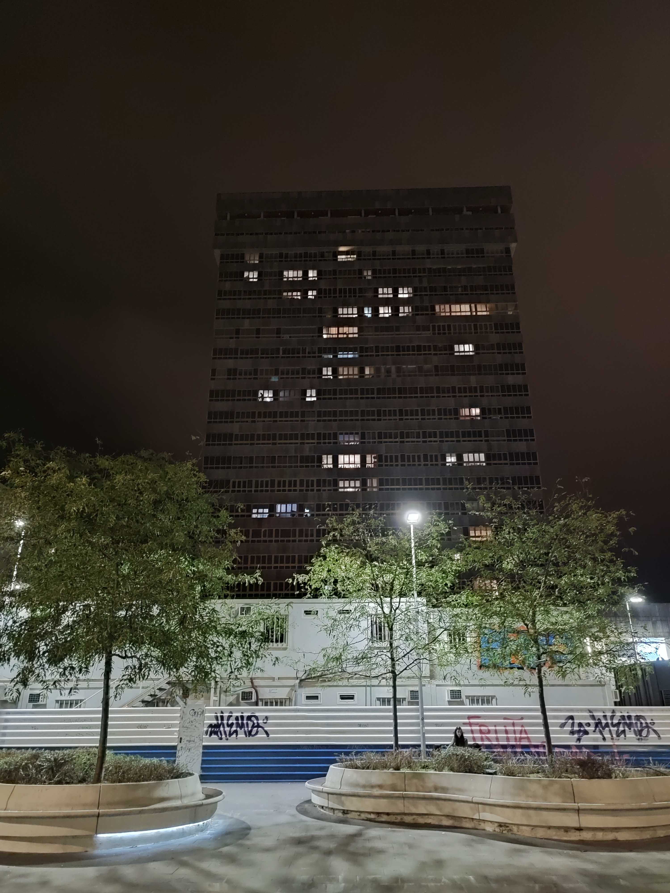
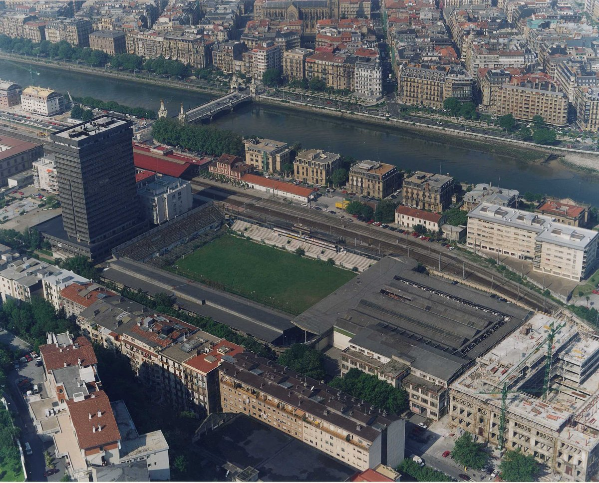

I was in San Sebastian last week. I stayed right across from the Atoxta tower,
the tallest building in the town. You can't miss it tbf.

I'm not an architecture buff or anything like that, but this hench grey building
was arresting. Walking home from town across the river (Urumea), it towered head
and shoulders over everything. What was it's story?

The Atoxta tower was built in 1972, designed by Mariano Oteiza and Juan Cruz
Saralegui. It stands at 21 floors, the tallest building in the city. The maximum
allowed height for buildings in San Sebastian is actually 11 stories, which is
why the tower stands out so much. Some locals seem to hate it so much there's a
building snuff vid out there.



Real Sociedad's old stadium, Atoxta (1913-1993), used to be right behind the
tower. Imagine watching a game from the 21st floor. FIFA birds-eye view camera
vibes.

I couldn't find out much else really, other than it's still occupied by
residents today. I read _Do Androids Dream_ recently, so mysterious apartment
blocks are sending my imagination wild atm.
