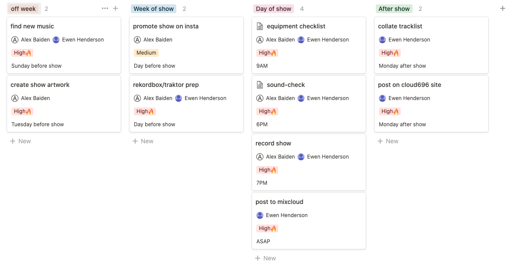
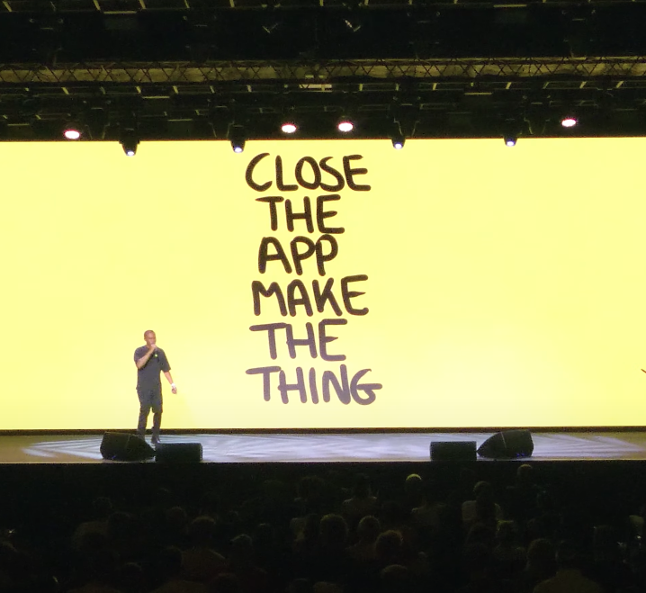

I've been broadcasting a homemade radio show with my mate for nearly a year now.
You should check us, still going strong every last Thursday of the month. On
reflection, we've got into a good rhythm of putting out quality shows and a year
of trial and error has taught us a few valuable lessons. I wanted to try and
write this down somewhere in case it can help other people starting out. Rather
than sharing advice on our creative practice, this post is about the unglamorous
practical bits. (N.B. we don't stream video, so this post doesn't go into that
stuff).

## Platforms

You will need to decide where people can go and listen to your stream. There are
a number of platforms that will provide an off-the-shelve service for you to get
streaming quickly with relatively little overhead (at a price). You might want
to broadcast to multiple channels via an intermediary application. If you really
have the minerals, you could even look into self-hosting.

### Mixcloud Live

You can livestream music and video using
[Mixcloud Live](https://www.mixcloud.com/live/). On top of the usual things you
need to broadcast, you need a [Mixcloud Pro](https://www.mixcloud.com/pro/)
account for this option. At time of writing, this subscription is £9 per month.

We use Mixcloud Live right now, but may switch in future. It's popular amongst
established online radio stations like
[Worldwide FM](https://www.mixcloud.com/live/worldwidefm/) and music venues like
[Brilliant Corners](https://www.mixcloud.com/live/BrilliantCorners). To be
honest, Mixcloud Live makes a lot of sense if you are already using Mixcloud in
general and have a following there. It's also on firmer legal grounds for DJs
playing other people's tunes than generalist streaming platforms like Twitch
where you should expect to get takedown notices before too long. Also, be aware
that the platform itself isn't that appealing to people that are casual
music/radio listeners and don't already have a Mixcloud account.

### Twitch

[Twitch](https://www.twitch.tv/) is easily the most well-known streaming
platform and you can broadcast a DJ set there if you like. It is probably the
best of the bunch for picking up casual and/or new listeners because it's
well-known and has the biggest existing user base. It's also well established
for streaming other types of content, if you want to experiment (e.g.
[Plastician](https://www.twitch.tv/plastician) ran music quizzes,
[UNIIQU3](https://www.twitch.tv/uniiqu3/videos) did production workshops).
However, be warned -
[Twitch is cracking down on DJ live streams](https://mixmag.net/read/twitch-dj-live-streams-copyright-news/)
so you need to be careful about what you play and prepared for past broadcasts
to evaporate at any time. It's also very much a video-first platform, so
audio-only streams are likely to be a bit out of place.

### Mixlr

If you aren't interested in streaming video, [Mixlr](https://mixlr.com/) is a
decent and less snazzy alternative to Mixcloud Live. It suffers from the same
problem of being very specialised and is therefore unlikely to attract drop-ins
from casuals. It's possibly a bit less annoying for listeners who don't want to
use the platform otherwise. Mixcloud really wants you to sign up and/or download
the app.

### Restream

There are now platforms that help you broadcast to multiple streaming services,
all at once. A popular example is [Restream](https://restream.io/) which lets
you simultaneously broadcast on YouTube, Twitch, Mixcloud and others. You can
stream on two platforms on their free plan, but must make do with Restream
branding in streams. The standard plan is $16 a month, currently.

### Self host

If you have the time and patience, you could try and host a livestream yourself.
There are tools out there to help with this, such as
[Owncast](https://owncast.online/). While the overheads are going to be bigger
(and potentially expensive, if your audience grows substantially), there are
some big benefits that come with this kind of effort. You can attain a level of
creative control and ownership over your stream that you will never be able to
while subscribing to a platform.

## Software

There are things you can download or use in the browser, at no extra cost, that
will help you set up your stream and promo it (if you want to).

### Streaming

You need software that can take what you're doing and broadcast it somewhere
live. [OBS Studio](https://obsproject.com/) is recommended for DJs. It's free
and ultra-reliable, plus has a strong user community so you can find tutorials
on YouTube very easily. [Streamlabs](https://streamlabs.com/) is another service
I've come across but haven't actually tried out.

### Making artwork

Artwork for an online radio show isn't essential, but lots of platforms (and
increasingly listeners) expect you to provide it. It's definitely way down the
list of things to nail down, but if you're not an artist or designer (and don't
know any) this might be the bit you're least sure about.

A common format for show artwork (and tracklists) is to use your own photos or
images from the web with text overlays:

This sort of thing can be made using [Photopea](https://www.photopea.com/), a
free and feature-rich Photoshop alternative. We use it quite a lot for our own
stuff and it is also compatible with Photoshop (PSD) templates that bigger radio
stations often use for consistent branding. Therefore, getting used to working
with Photopea and PSD files will come in handy if you end up with a show on a
station later.

Alternatively, you could try your hand at making your own illustrations from
scratch. There's obviously the pen-and-paper route, or you can try popular
digital illustration apps like [Procreate](https://procreate.art/) (iOS only).

### Video edits

Someone we've dabbled in is putting together short videos with audio clips from
the show, as a way of promoting the show after it's been archived. This is a
two-step process of clipping the audio into an MP3 file (with
[Audacity](https://www.audacityteam.org/)) then overlaying images/video onto the
audio as an MP4 file (with [Headliner](https://www.headliner.app/)). There are
more extensive video editing programs out there, but specialised software for
making audio clip videos can make this a low-cost job. Still, this is another
optional thing that can come later.

### Storage

You'll need somewhere to back-up the files you're creating. These include image
(e.g. artwork, logos, photoshop templates), audio (e.g. show recordings), video
(e.g. show clips) and text (e.g. tracklists) files. Ideally, you should get into
the habit of backing up these files consistently as early as possible. It's not
fun doing it in bulk or worse, losing high-quality recordings completely.

We use a fairly obvious option,
[Google Drive](https://www.google.co.uk/intl/en-GB/drive/). We made a new
account for easy shared access and 15GB of space for free. This does the job for
us for now, at least. Other well-known options are
[Dropbox](https://www.dropbox.com/en_GB/) and
[Amazon S3](https://aws.amazon.com/s3/) (for large file storage). Of course, if
you don't need shared storage, you could always front the money for an external
hard drive instead.

## Hardware

Assuming you've already got a DJ setup (if not, check out
[this guide from Pirate](https://pirate.com/en/blog/dj-tips/beginners-dj-setup/)
for some advice), what else will you need to cop to have a functional streaming
setup?

### Microphone

Unless you have zero intentions of speaking over the tunes, you can do with a
mic. This will give your voice clarity and amplification over the track. We went
with the
[Auna Mic-900B](https://www.auna-multimedia.co.uk/Microphones/Condenser-microphones/MIC-900B-USB-Cardioid-Studio-Condenser-Microphone-Black-Black-Black.html),
a relatively affordable (£50 on Amazon) condenser mic that you can plug into a
computer via USB. If your budget can go a bit further, the
[Shure MV7](https://www.shure.com/en-GB/products/microphones/mv7?variant=MV7-K)
comes highly recommended and features an XLR connector that should work with
most industry standard DJ mixers.

Now, you _can_ get away without a microphone arm/stand if you get a bit
creative. We have managed to balance the mic at a good height using an empty 2
pint beer stein (lol), but especially with two bodies huddled around the mixer a
DIY set-up like this can be tricky at times. If you can, just get the
[T20](https://www.amazon.co.uk/Microphone-TONOR-Adjustable-Suspension-T20/dp/B082YN7KY9/?th=1)
and avoid foolishness.

### Audio interface

In order to get the audio from your DJ mixer into your computer so that it can
be streamed, you will probably need an audio interface. If you are using
"time-code" DJ software (e.g. Serato, Traktor) already, you likely already have
one. If not, the
[Behringer U-Phoria UMC202HD](https://www.behringer.com/product.html?modelCode=P0BJZ)
looks like a great choice on a budget (£80 on Amazon).

## Logistics

Once you've got the gear, you're ready to start streaming. It helps to spend a
bit of time making a plan of the things you want to do before and after each
show, especially before the first one.

### Scheduling

Setting a regular broadcast schedule will help listeners know when to expect a
set and plan ahead. It will also help you develop a sustainable practice. Common
schedules are:

- once per week e.g. 6-8 PM every Monday
- once per month e.g. 7-10 PM on the last Thursday of the month

Set a schedule that allows you time to produce shows you're happy with and that
you can sustain long-term.

### Task management

Holding all of the work that goes into a show in your head can be unduly
stressful, and distract you from the all-important creative practice. There are
free project management tools that can help with this. We create a "board" in
[Notion](https://www.notion.so/) to track the regular jobs that we do for each
radio show, with a rough guide of when to do them.

You can make other shared pages in Notion, too. For example, we have a notes
page for capturing ideas and another page that simply contains links to other
important stuff. This could just as easily be used on your ones.

## Close

We are by no means at the finished product yet and are very basic on social
media, still. Hit me up with any feedback or tips, I'll try and work stuff back
into the post (with credit) if it fits.

Finally and most crucially, word to Elijah:

Can't emphasise this enough. This groundwork will put you in a better position
to sustainably produce a DIY radio show, but actually making the thing (and
enjoying doing so) is the only bit that matters.
