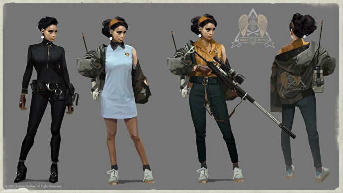
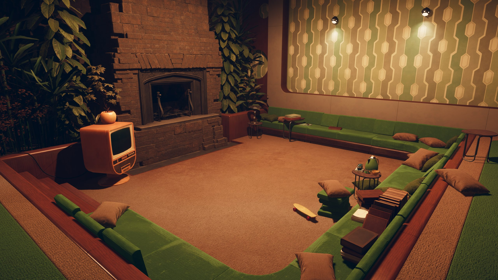
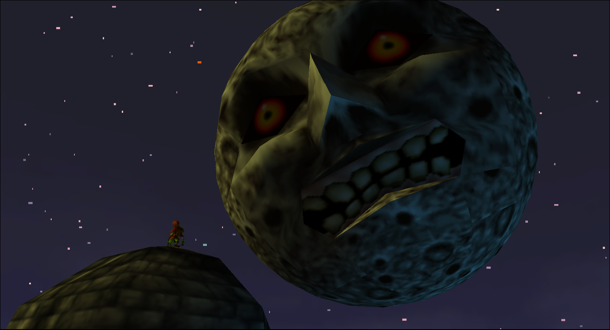

There's a fun little show on N\*tflix called
[Russian Doll](https://www.imdb.com/title/tt7520794/) where Nadia (played by
Natasha Lyonne, good egg) keeps dying in-and-around her 36th bday party for the
whole first season. It's your time loop drama premise with death, but it rides
on silly + scatty energy led by Lyonne (Nadia's first theory for the time loop
is that it's her first k-hole). There's a stylistic confidence going on that
makes this rendering of NYC feel full up. As the series progresses, the whimsy
sheen reveals itself to be (partly) a defence mechanism of Nadia's that gives
way to sincere melancholy and introspection. The time loop is effectively
deployed as a metaphor for reliving, and healing from, trauma. It hits the
emotional notes smoothly all the way down (BTW I haven't seen the second series
yet but I hear it's decent, too).

Related, I clocked Deathloop over the weekend. As the name suggests, you seem to
die and then wake up on that same morning ad infinitum. In vibe and looks it
felt like the devs were rehearsing for a _Russian Doll_ tie-in game (a bit like
[IO making a _James Bond_ game](https://www.gamesradar.com/project-007-james-bond-game-io-interactive-guide/)
after making _Hitman 3_, def the most _Bond_ game ever). You play as Colt, who
cracks jokes to himself and cusses out the only other character he really has
dialogue with, Juliana. The in-game aesthetic is like a 1960s action film set
world-building exercise that helps you dissociate and lean in to the game's
absurdity.

You decide to go looking for clues that might piece together this mystery and
explain how to murk all of the baddies in a single day and "break the loop".
When you make a significant discovery, an animated cut-scene interjects and
stylistically summarises the plot, while the "leads" menu neatly charts out how
the puzzle pieces fit together. The detective work is basically done for you. In
this sense, the time loop and story elements interact in ways that can't help
but feel choreographed. This is normal for story-driven AAA video games these
days, but I found myself disengaged with the story itself by the endgame because
the mystery didn't feel like my own. This wasn't helped by Arkane going super
heavy on the environmental storytelling, to the point where the protagonist
talks to himself more than anyone else.

The gameplay is suave and empowering even if you're an FPS noob (it me). You
quickly learn that the "map" is quite diddy and requires you to retread your
steps (a lot). What this means is that you inevitably learn the layout of each
area and the patterns of enemies within. As time progresses your weaponry combo
experiments mature and you can get truly creative. What this meant for me was a
rotating assembly of guns in the right hand and superpowers in the left,
deployed inventively to the same crews of lackeys I'd inflicted pain on the
previous day. I see this learning curve as congruent with the auto-pilot
investigative work. The game wants you to feel smart and to play it like a
movie. It took me a little while to get there.

Towards the main story's close, the game makes you repeat a pretty dull level
section + puzzle several times. When I realised what I was being asked to do I
was vexed. It felt like a layer of punishment on top of repeating the same areas
again and again already. Today I oddly reflect on this sequence as lovely game
design that shook me into playing the game properly. The frustration I felt at
being made to repeat this segment multiple times, in quick succession, jolted me
into the mode of play I describe in the previous paragraph. Before this point, I
was still dawdling and camping when Juliana was "on the hunt" for me. Once I was
pissed off at the game I started diving into encounters and letting instinct
take over. I can see how this segment would be torturous for confident FPS
gamers but it's what I needed for things to click into place.

Something I find funny about a game based around a time loop is that all games
are built on countless loops. The recycled boss designs, the enemy patrol
patterns, every single fetch quest. I mean, even between different games put out
by any given studio there are recycled assets. This is not a knock, at all,
rather a curiosity as to the state of mind of a developer working on a game like
this. The obvious reference point is _The Legend of Zelda: Majora’s Mask_,
perhaps the most famous time loop game ever made, which endured
[an infamously batshit development cycle](https://www.polygon.com/2020/4/30/21241902/the-legend-of-zelda-majoras-mask-was-never-supposed-to-exist).
The process of going deeper and deeper, combing over that same bit of game is
something that consumers aren't usually asked to indulge in, but a time loop
game demands that you endure a slice of this experience.

Deathloop has flaws that mean I walk away it with confused feelings. It forces
the average player closer to the experience of actually making the game in ways
that seem brave and interesting. By the end, if someone was watching me play I
reckon they would think I was pretty good at the game. Unfortunately, I don't
think the work is imbued with much meaning beyond this. If you're asking, I
would probably tell you to watch _Russian Doll_ instead.
