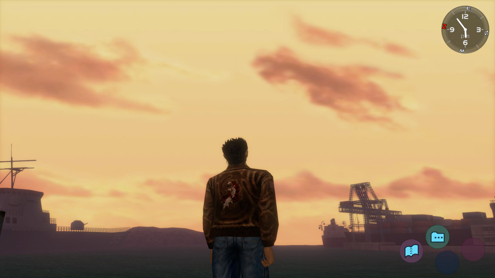

At my big age, being a one-time Dreamcast kid feels almost too achingly hipster
to believe. No word of a lie, I haven't met anyone else who went home to that
silly, lovable (and bizarrely lightweight) cube. As a cultural artifact it
perfectly embodies the pre-millennium optimism that every early 90s baby
remembers being in the air those times. In the same vein as
[9 PM (Till I Come)](https://www.youtube.com/watch?v=5A9OIIapSko&ab_channel=85KasiaD85)
and New Labour, these relics formed a giddy tapestry of utopian possible
futures. Sega really went and launched a console with internet capabilities in
1998, a time when most of us had to convince mum to unplug the phone so we could
get half hour on
[MSN messenger](https://www.youtube.com/watch?v=9pzpQrmzFKw&ab_channel=james19892),
along with a
[controller that housed a virtual pet](https://www.youtube.com/watch?v=GCnJDmrit9U&ab_channel=videogameclipcollect)
inside it. The Dreamcast was the byproduct of an idyllic, hubris-heavy time of
[Things Can Only Get Better](https://www.youtube.com/watch?v=gi5j7jjhm4M&ab_channel=GreatBritishPolitics)
type vibes.

My whirlwind Dreamcast romance feels oddly personal, because it lived at my
dad's house. I didn't have any friends where my dad lived, so when I played it I
was almost always on my ones. I had never owned previous-gen Sega consoles, so
my reference points were limited to the odd turn of Sonic or Aladdin after
school at mate's houses. The fact that so much of it's functionality was beyond
my own (and my dad's) comprehension gave it a mystical appeal, like a
premonition of future wonders the new millennium was to bring. Because I didn't
get to play it much, I tended to rent out games (maybe the most accurate prelude
to the new millennium we ended up with - rentier capitalism) for a night or two.
The time-boxed nature of the video game rental lent itself to intense,
transfixed play sessions that I have trouble filing away as "good" memories. The
game usually had to be returned the next day, when I would then be returned to
my mum's house too. I can't imagine that these kinds of weekends were the ones
my dad most enjoyed spending with me, and I think I intuitively understood this
as I dropped the Dreamcast game jewel cases into Bishops Stortford Blockbuster's
post box and snapped back to reality.

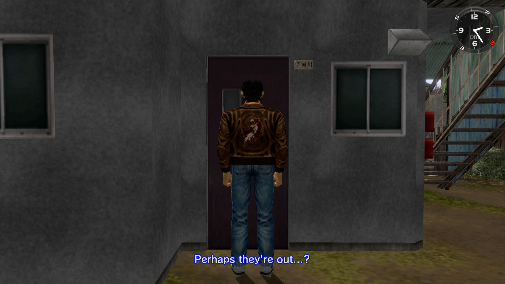

Returning to Shenmue this past month, 20+ years on was a chance to slowly play a
game that I had memorable dalliances with during that time. Shenmue was
developed and published by Sega for the Dreamcast in 1999 (but it came to the UK
in 2000) and "remastered" for the PS4 in 2019. It was created, produced and
directed by [Yu Suzuki](https://en.wikipedia.org/wiki/Yu_Suzuki) of Virtua
Fighter and Outrun fame. The development cost was unprecedented in it's time,
[holding the production budget record ($70 million) for 9(!) years until GTA IV ($100 million)](https://www.eurogamer.net/gta-iv-is-most-expensive-game-ever-made#:~:text=Grand%20Theft%20Auto%20IV%20%2D%20%24100,Shenmue%20%2D%20%2470%20million)
was released in 2008. Ironic that basically everyone I know played and gawped at
GTA IV, but if I brought up Shenmue in the same rooms there would be crickets.
Unfortunately, groundbreaking technical feats like this are really difficult to
appreciate later ("you had to be there", basically). If you show someone Blade
Runner for the first time today, they will probably enjoy the film but think
that the special effects are goofy. When I first traipsed around Shenmue's
streets and realised I could go into the arcade to play other Yu Suzuki games,
or phone someone up (with tinny voice acting, not Simlish or whatever), or
collect toys from gacha machines, something felt different. This was a level of
immersion and simulation that made every other game world before it (and after
it, for a little while) seem shallow.

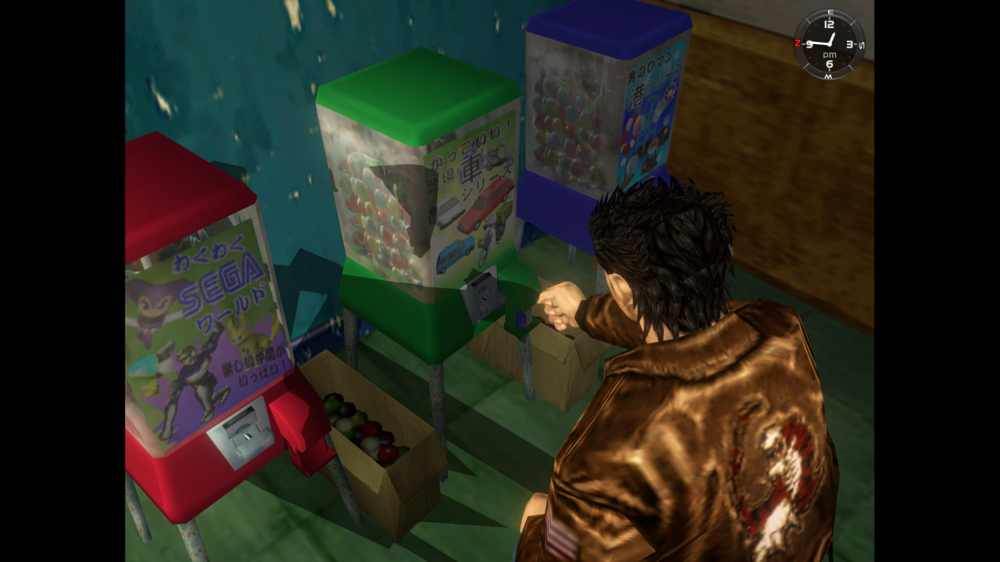

Shenmue is talked up as the first "open city" game ever made (the title for
first "open world" game might go to an early DMA Design effort for the N64, Body
Harvest, which I also rented). I don't really know how much meaning I ascribe to
this term but I can talk about what "living" inside Shenmue feels like. You play
as Ryo Hazuki, living in the city of Yokosuka (where Yu Suzuki grew up). Your
alarm clock goes off each morning, then you get on with your day as you please.
You carry around a notebook that tracks progress through the main story, but for
most of the game you can engage with the critical path pretty loosely. As you
familiarise yourself within neighbourhoods of Shenmue, not only do you begin to
see familiar faces, you learn their routines. When you're not badgering citizens
with scatter-brained detective work, you ask them normal things like "how's
business", and they might observe that you "always look so healthy". Despite Ryo
being an awkward, generally pre-occupied soul, it's hard not to feel warmth and
comfort from these reliably dumb interactions (apart from when people are
walking around - they will fob you off with unsettling regularity). These
characters live somewhere in the neighbourhood and you can actually go and find
their homes (in a non-creepy way) because their names are written on the post
boxes. There's a US military base right next to Yokosuka IRL so many of the
in-game shops sell military surplus and the like. You can find mementos around
the Hazuki family home like family photos and playable cassette tapes. These are
touches that aren't even a given in open-world games today. Back then, this
stuff made my 10 year-old mind go bananas.

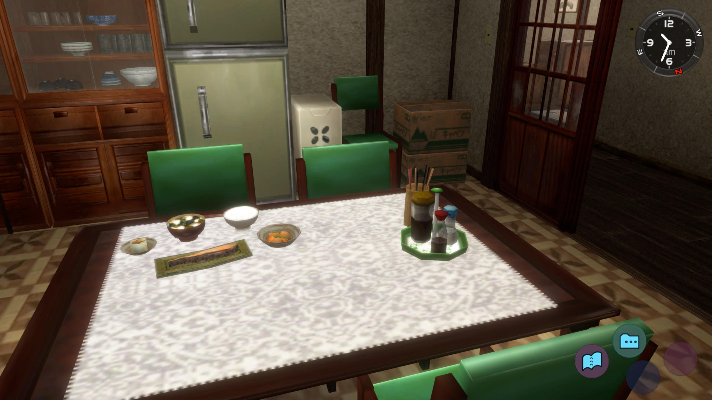

Quick-time events (QTEs) are another innovation credited to Shenmue. You know
the one, where you have to press buttons on the controller during action
sequences that play like cut scenes. I usually find these to be uninteresting
distractions and I don't really understand why they caught on. In this game they
tend to accompany scenes where Ryo is chasing someone or is in a fight indoors.
It's curious that these became a hallmark of AAA games (which Shenmue
undoubtedly is), maybe because they are just expensive and extraneous segments
that smaller studios wouldn't bother with so it has become an ongoing weird
flex. What's strange here is that the whole virtua fighter engine was
transplanted into the game, yet there actually isn't that much active fighting.
The decision to incorporate QTEs that replace potential fighting opportunities
contributes to the slower pace of the game that can feel jarring 20 years on.
Imagine The Last Of Us making you sit and wait for half of an in-game day while
you wait for the only story-line task to progress. Shenmue does this a lot and
makes me wonder if these are design choices are simply the rough edges of a
pioneering foray into environmental storytelling and a world that feels lived
in.

I haven't really talked about the story because it's pretty shit tbh. Your
in-game dad is killed by Lan Di and you are out for revenge, basically. However,
towards the end of the mainline story you end up working down at the warehouse
district by the docks to try and get intel on the Mad Angels, a gang with links
to the big bad. Somehow, a section of the game devoted to manual labour comes
out smelling of roses. After your first day on the job, your boss tells you to
come back in the morning an hour before work starts. The alarm clock that goes
off every single in-game day dings an hour earlier, and the game fades up to a
queue of forklift trucks with Ryo bringing up the rear. It turns out that you
now take part in a forklift race every day before work with your dockworker pals
and receive a different toy truck depending on your finishing position. If
you're asking yourself "why?" at this point, perhaps AAA seriousness has led you
to miss the point of great video games - they are GAMES. Shenmue uses dev
trickery and production techniques to imitate aspects of cinema, but it doesn't
pretend for a second that it isn't a video game. This creates charming set
pieces and encourages playfulness (you are the "player", not the "audience"!).
I'm still here for all of it.

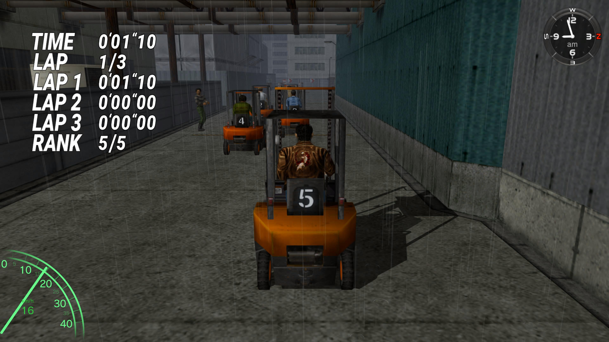

This game remains painfully of it's time, good and bad. It's innovations
probably won't be fully appreciated by newcomers who've already played modern
AAA open-worlders like Red Dead Redemption II, through no fault of their own.
The writing is frequently hilarious in a bad (but sort of good) way. The
controls are comically janky, to the point where I wondered if the forklift
section of the game inspired how Ryo should move in game. It's charm is still
off the scale, though, and so much of the imaginative heavy lifting for future
open-world games was done right here. This is "slow" art that should be sipped.
It doesn't make sense to dash through because you have to return the game in the
morning. I'm still grateful that I got to experience something groundbreaking in
the moment, don't get it twisted, but the atmosphere Shenmue bathes you in is
what makes it a lovely time today. Nice one, dad <3

## Footnotes

- [Dreamcast: A Forensic Retrospective](https://www.eurogamer.net/dreamcast-a-forensic-retrospective-article)
- [A postcard from Yokosuka: Retracing the steps of the original Shenmue](https://www.eurogamer.net/shenmue-retrospective)
- [phantomriverstone.com](https://www.phantomriverstone.com/)
- [Shenmue livestream with Heather Alexandra and Tim Rogers](https://www.youtube.com/watch?v=fcx-EF0fgNk)

## Screenshot reel

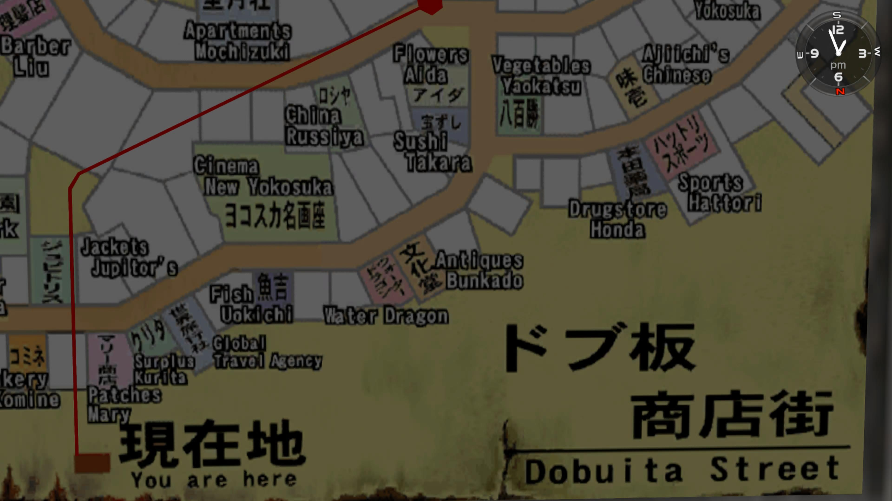

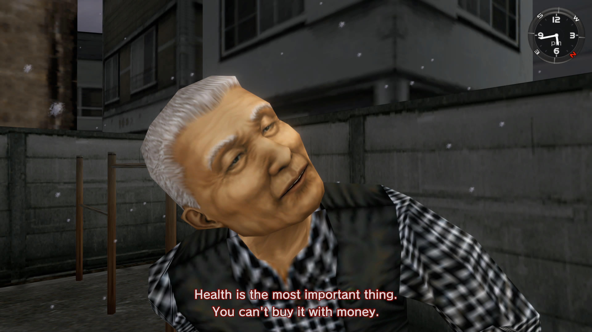

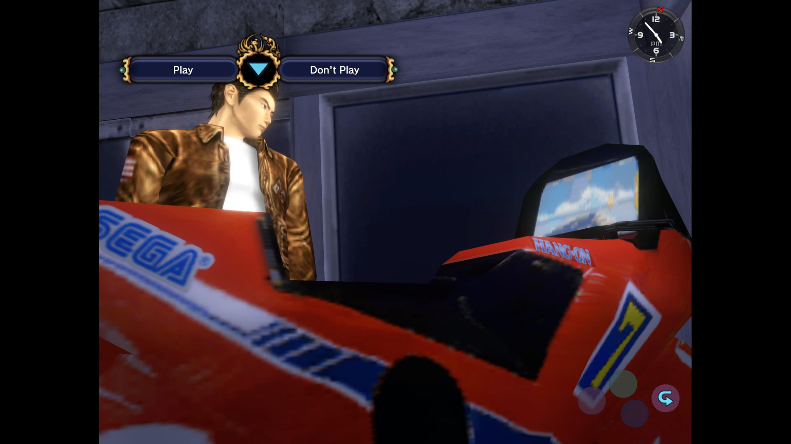

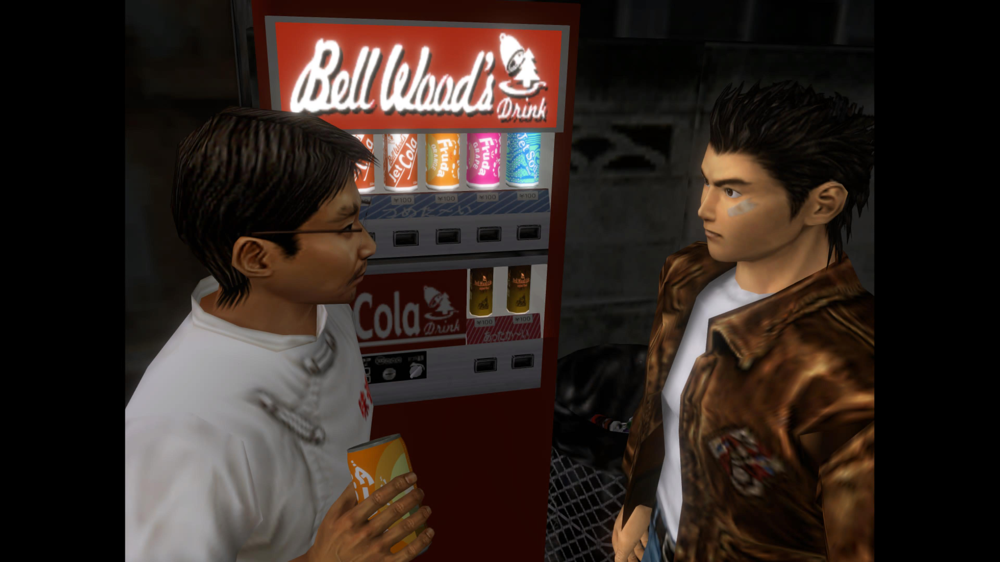

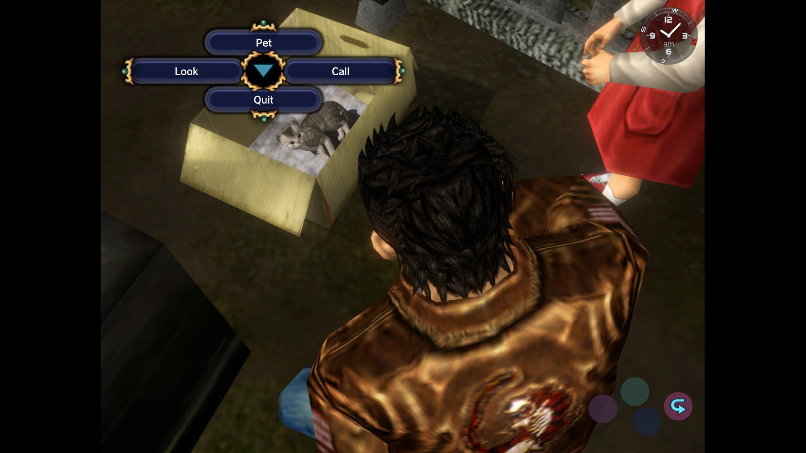

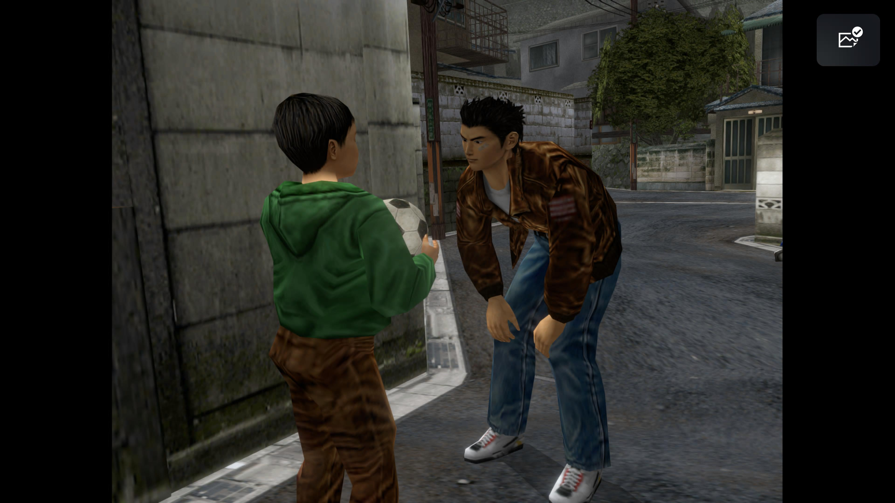

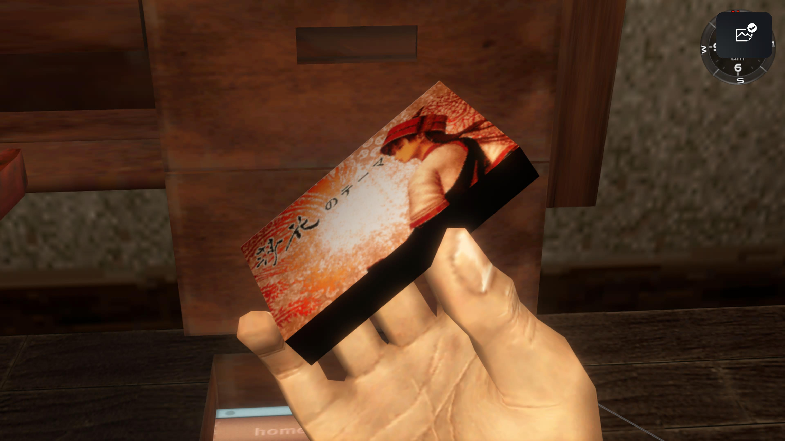

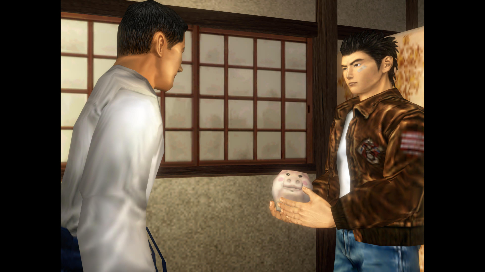

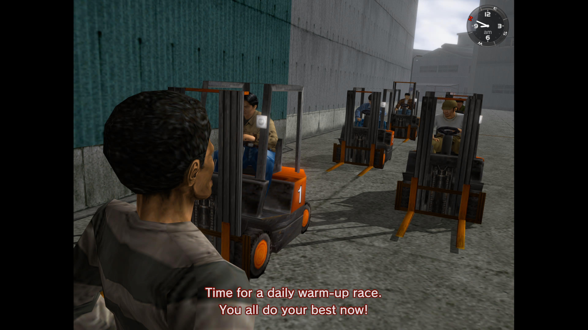

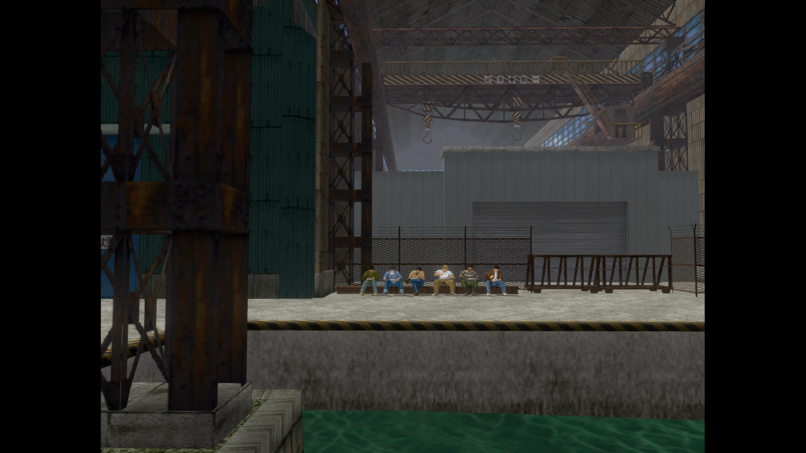
