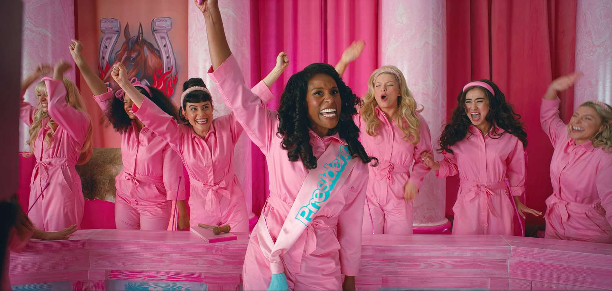

<blockquote class="quoteback" darkmode="" data-title="Outlaw Culture: Resisting Representations (2012)" data-author="bell hooks" cite="https://collectiveliberation.org/wp-content/uploads/2013/01/hooks_Love_As_The_Practice_Of_Freedom.pdf">
The function of art is to do more than tell it like it is – it’s to imagine what is possible.
<footer>bell hooks<cite> <a href="https://collectiveliberation.org/wp-content/uploads/2013/01/hooks_Love_As_The_Practice_Of_Freedom.pdf">https://collectiveliberation.org/wp-content/uploads/2013/01/hooks_Love_As_The_Practice_Of_Freedom.pdf</a></cite></footer>
</blockquote>
			
I thought [_Barbie_)](https://letterboxd.com/film/barbie/) was a solid film. Powerful tonal shifts, a mostly
banging soundtrack and emotional heft in the right places (my gf was in bits after five mins). There's the whole
franchise/sequel dark age critique that has been done to death, although
[Blindboy found an angle](https://play.acast.com/s/blindboy/barbie-and-mattel-as-millennial-pavlovian-conditioning)
wondering when millennials will finally be marketed to as middle-age instead of
"young people" that I lapped up. Here, I just want to do a little vent about the
ending and why it felt pessimistic to me.

Full disclosure: I read
[my first bell hooks book](https://uk.bookshop.org/p/books/the-will-to-change-men-masculinity-and-love-bell-hooks/5997673?ean=9780743456081),
_The Will to Change: Men, Masculinity, and Love_, earlier this year. It's maybe
embarrassing to admit as a man approaching middle age, but my internal feminist
logic before this was back-of-a-fag-packet, hr-diversity-and-inclusion-seminar
level stuff. I enjoyed the
[MORE 👏 WOMEN 👏 DRONE PILOTS 👏 meme](https://knowyourmeme.com/photos/1353985-hire-more-women-guards)
and nodded along when podcasts would deliver "respect women" platitudes, perhaps
while detailing Megan Thee Stallion being shot. On occasion, I may have even
comforted myself by sincerely thinking "I'm an ally" or, another cringe-fest,
"I'm Doing The Work".

I'm likely in dicey "reads bell hooks once" slash "33 YO man REACTS to bell
hooks for the first time!" territory here but as a Geezer reading this book I
learnt:

- the extent to which male spiritual suffering is guaranteed under patriarchy
- without an anti-patriarchal mindset, feminism is prone to reproduce a logic of
  domination
- how solidarity between men and women, rooted in love, is necessary to
  dismantle patriarchal forms
- that spiritual healing and nurturing of men is possible, and necessary, within
  a radical feminist vision for change

Here's a related anecdote. My first stable, short-lived job out of university
was a recruitment consultant in Nottingham on 16k a year (and if you're thinking
I got juicy commissions instead, I was unbelievably shit at this profession). I
worked in a very small (~10 ppl) office that was almost exclusively women. Very
progressive and cool, I thought! As it turns out, the standard tools of
domination were routinely wielded over my precarious, pathetic employment
contract with absolutely no bother. I was targeted on the number of cold calls I
was making every day, given the dreaded personal development plan (AKA we want
to sack you, nice and legally) and even taught how to skim money off the top of
our contractors pay packets via umbrella companies. The "floor" had an
ultra-competitive, money-obsessed air that frequently bubbled over into
confrontation and hostility. It turned out this matriarchy didn't create a
healthy workplace by osmosis, it was giving disciplinaries and trauma. To make
it abundantly clear - on a personal level, I had time for almost everyone in the
building. I rate recruitment as a realistic avenue for working class, often
non-graduates to make a decent living (eventually). My lasting observation is
that a traditionally hierarchical, toxic, macho culture reasserted it's
exploitative practices via women who had learnt well from the patriarchs that
came before them. As hooks says:

<blockquote class="quoteback" darkmode="" data-title="The Will to Change: Men, Masculinity, and Love" data-author="bell hooks" cite="https://archive.org/details/willtochangemen00hook">
More than ever before in our nation’s history, females are encouraged to assume the patriarchal mask and bury their emotional selves as deeply as their male counterparts do. Females embrace this paradigm because they feel it is better to be a dominator than to be dominated. However, this is a perverse vision of gender equality that offers women equal access to the house of the dead. In that house there will be no love. 
<footer>bell hooks<cite> <a href="https://archive.org/details/willtochangemen00hook">https://archive.org/details/willtochangemen00hook</a></cite></footer>
</blockquote>

📢 Oi!!! Barbie spoiler warning ahead 📢

Much of _Barbie_ is set in a fictional, sugary sweet kingdom called Barbieland.
One of the film's central tensions is how the "Kens" are made to occupy the role
of the dominated under a matriarchy and experience oppression from various
social and decision-making spheres. A tag-line used all over the film's
marketing is "Barbie is Everything. Ken is Everything Else". As the film
progresses, it elegantly tees up an opportunity for the Kens to rebrand the
kingdom as "Kenland" and establish an overt, trashy patriarchy. Through this
process, both Barbie and Ken have first-hand experience of living as the
dominated gender in society. Barbie comes to regret the exclusionary,
psychologically damaging cultural practice in Barbieland of "every night is
girls night". Yet, despite the unique opportunity to establish an equal society
with a true coalition across genders staring them square in the face, the film
ends with the full restoration of Barbieland to it's default matriarchal
arrangement. U wot, m8? I can't read this any other way than being deeply
cynical about relationships between men and women, as well as the prospects of
an equal society across lines of gender.

I get that this is one of the films the whole industry is banking on to bring
ppl out. I wasn't expecting a radical feminist agenda to be front and center of
a hollywood blockbuster. Maybe Mattel insisted on an ending that upheld the
status quo of the Barbie universe. Still, the film was explicitly about
patriarchy which seems to have baited out Piers Morgan and the like already. At
worst, the film becomes counterproductive and invites patriarchal men to
understand feminism as a cause external, even harmful, to themselves.

That's it rly! I should acknowledge once more that this is principally a fun,
nostalgia-drenched film that was not made for me. Lots of people love the film,
and good on them. I would recommend it to a pal, still. Thank you for letting me
scratch this itch, pls go enjoy life again.

Oh, and read more bell hooks, always.
